# 联接

机械联接分为**动联接**和**静联接**两大类。在动联接中，被联接件的相对位置能够按需要变化，亦即各种运动副；在静联接中，被联接件的相对位置固定不动，亦即把某些零件固联成为一个构件，这是本文所要讨论的内容。

> 在本书中，联接凡未指明是动联接的，均指静联接。

联接有可拆的和不可拆的。允许多次装拆无损于使用的联接称为**可拆联接**，如螺纹联接、键(包括花键)联接和销联接；若不破坏组成零件就不能拆开的联接称为**不可拆联接**，如铆接、焊接和黏接。过盈联接则可做成可拆的、也可做成不可拆的。

## 螺纹联接

### 螺纹的形状与参数

螺旋线：一动点在一圆柱体的表面上，一边绕轴线等速旋转，同时沿轴向作等速移动的轨迹。

螺纹： 一平面图形沿螺旋线运动，运动时保持该图形通过圆柱体的轴线

#### 螺纹分类

1. 按螺纹的牙型

2. 按螺纹的旋向

右旋螺纹、左旋螺纹

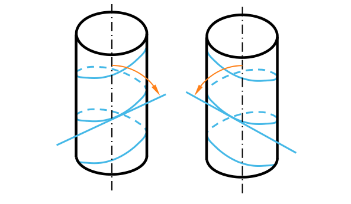

3. 按螺旋线的数目

单线螺纹、多线螺纹

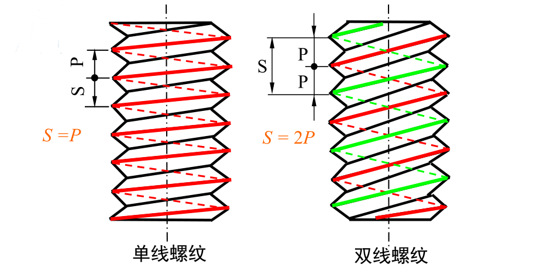

4 按回转体的内外表面

外螺纹、内螺纹

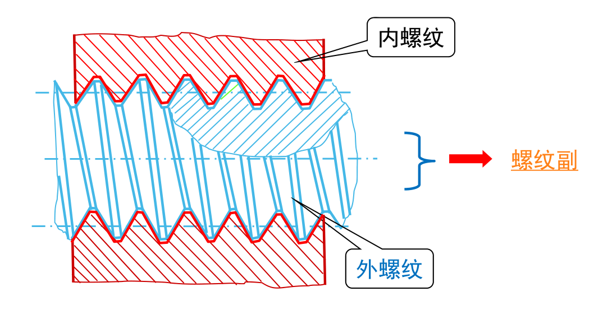

5. 按螺旋的作用

联接螺纹、传动螺纹

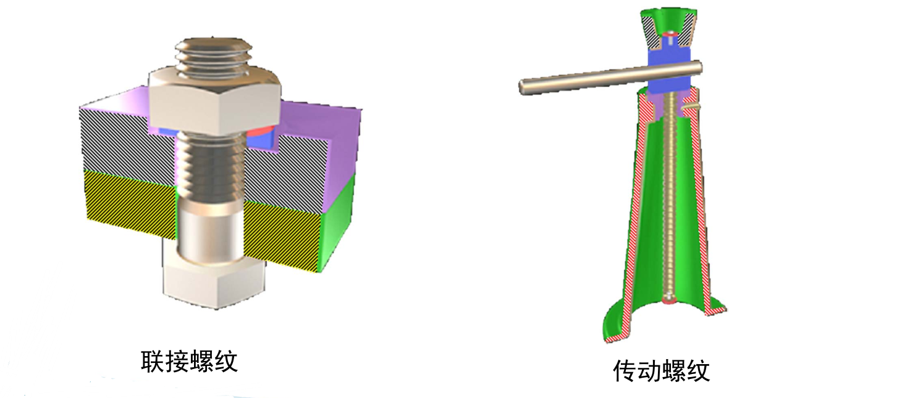

6. 按母体形状

圆柱螺纹、圆锥螺纹

#### 螺纹参数

(1) 大径$d$： 与外螺纹牙顶(或内螺纹牙底)相重合的假想圆柱体的直径。

(2) 小径$d_{1}$： 与外螺纹牙底(或内螺纹牙顶)相重合的假想圆柱体的直径。

(3) 中径$d_{2}$： 也是一个假想圆柱的直径，该圆柱的母线上牙型沟槽和凸起宽度相等。

(4) 螺距$P$： 相邻两牙在中径线上对应两点间的轴向距离。

(5) 导程$S$： 同一条螺旋线上的相邻两牙在中径线上对应两点间的轴向距

(6) 螺纹升角$\lambda$： 中径$d_{2}$圆柱上，螺旋线的切线与垂直于螺纹轴线的平面的夹角

$$
\tan \lambda=\frac{n P}{\pi d_{2}}
$$

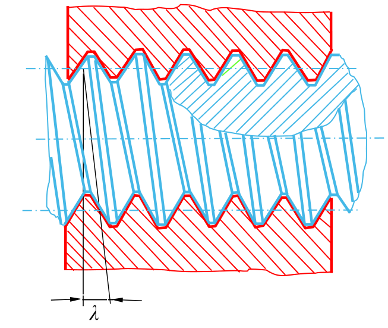

(7) 牙型角$\alpha$： 轴向截面内螺纹牙型相邻两侧边的夹角。
牙侧角$\beta$： 牙型侧边与螺纹轴线的垂线间的夹角

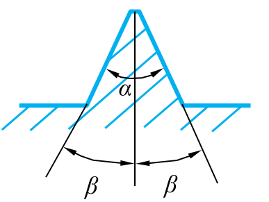

### 螺旋副的受力分析

#### 矩形螺纹

$F_{a}$ 轴向载荷

$F$ 驱动力

$T$ 驱动力矩

$f$ 摩擦系数

$\rho$ 摩擦角

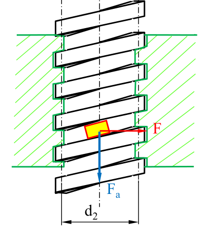

有
$$T=F \frac{d_{2}}{2}$$

$$f=\tan \rho$$

螺纹拧紧： 螺母在$T$和$F_{a}$ 的联合作用下，逆着$F_{a}$等速向上运动。

$$
T=\frac{d_{2}}{2} F_{a} \tan (\lambda+\rho)
$$

螺纹拧松： 螺母在$T$和$F_{a}$的联合作用下，顺着$F_{a}$等速向下运动。

$$
T=\frac{d_{2}}{2} F_{a} \tan (\lambda-\rho)
$$

若$\lambda \leq \rho$，**自锁**。

#### 非矩形螺纹

$$
f^{\prime}=\frac{f}{\cos \beta}=\tan \rho^{\prime}
$$

$f^{\prime}$ 为当量摩擦系数，$\rho^{\prime}$ 为当量摩擦角

可像矩形螺纹那样对非矩形螺纹进行力的分析

#### 效率

螺旋转动一圈时，有效功为$F_{a} S$，输入功为$2 \pi T$

定义螺旋副的效率为有效功与输入功之比
$$
\eta=\frac{F_{a} S}{2 \pi T}=\frac{F_{a}}{F_{a} \tan \left(\lambda+\rho^{\prime}\right)} \cdot \frac{S}{\pi d_{2}}=\frac{\tan \lambda}{\tan \left(\lambda+\rho^{\prime}\right)}
$$

对于传动螺旋，一般取 $\rho^{\prime}<\lambda \leq 25^{\circ}$

对于联接螺纹，必须取 $\lambda \leq \rho^{\prime}=5.7^{\circ}$

### 常用螺纹

#### 三角形螺纹

这种螺纹牙根厚、强度高，牙形角大，当量摩擦系数大，自锁性能好、传动效率低,适用于联接。

普通螺纹$\alpha=60^{\circ}$

普通螺纹以大径$d$为公称直径，同一公称直径可以有多种螺距，其中螺距最大的称为粗牙螺纹，其余的统称为细牙螺纹。

细牙螺纹的优点：升角小、小径大、自锁性好、强度高；缺点：不耐磨易滑扣。

#### 管螺纹

管螺纹：公称直径为所连接管子的公称通径

管螺纹$\alpha=55^{\circ}$

#### 梯形螺纹和锯齿形螺纹

常用于传动

梯形螺纹 $\beta=15^{\circ}$

锯齿形螺纹 $\beta=3^{\circ}$，锯齿形螺纹只适合单向传动，可消除因摩擦而产生的间隙

### 螺纹联接的基本类型及其紧固件

#### 螺栓联接

用于经常拆装易磨损之处

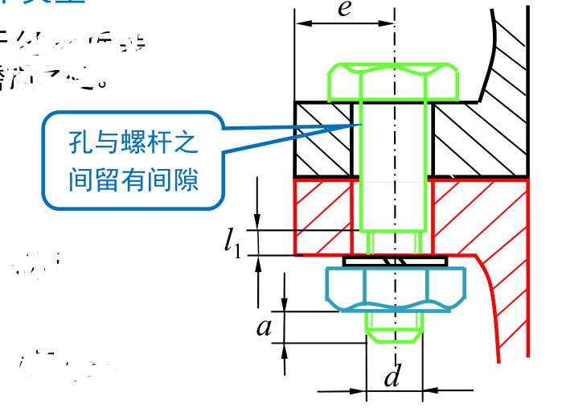

螺纹余留长度 $l_{1}$

静载荷 $l_1$ >=(0.3~0.5)d;
变载荷 $l_{1}$ >=0.75d;
冲击载荷或弯曲载荷 $l_{1}$ ≥ d;
铰制孔用螺栓 $l_{1}$ ≈ 0;
螺纹伸出长度a=(0.2~0.3)d;
螺栓轴线到边缘的距离 e=d+(3~6) mm

地脚螺栓，用于把机架或机座固定在地基上的螺栓，其一端埋在地基内并浇灌混凝土

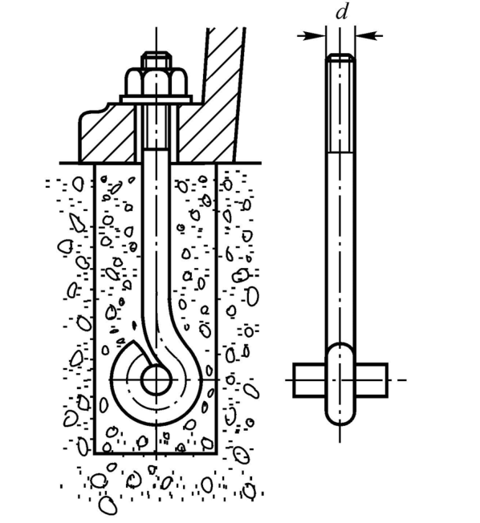

#### 螺钉联接

结构简单，省了螺母，用于被联接件
之一较厚、不便加工通孔的场合，不
宜经常拆装，以免损坏螺纹孔

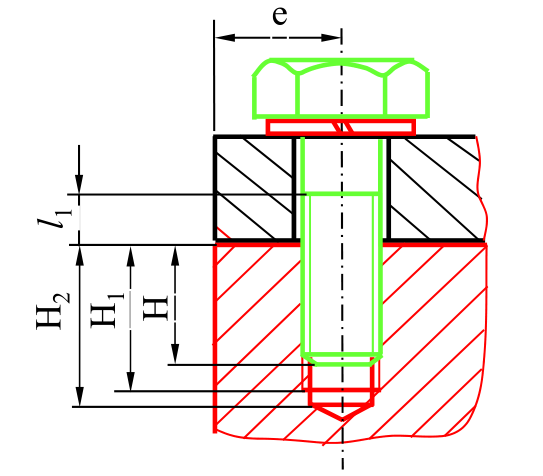

参数l 1 、e、a与螺栓相同

#### 双头螺柱联接

联接件厚，允许拆装

#### 紧定螺钉联接

可传递不大的力和转矩

#### 螺纹紧固件

螺栓

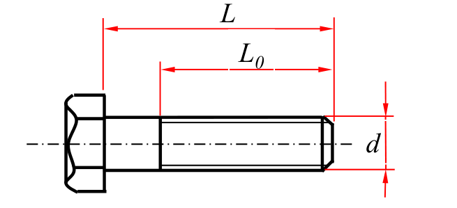

双头螺柱

螺钉、紧定螺钉

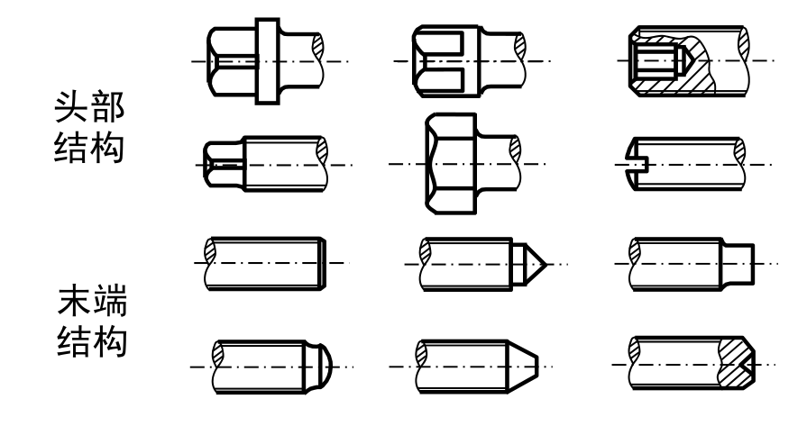

螺母

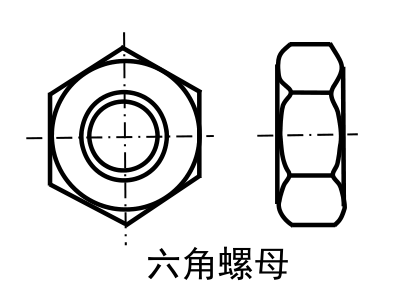

垫圈

增加支撑面积以减小压强，避免拧紧螺母擦伤表面、防松。

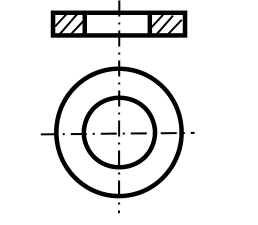

### 螺纹联接的预紧和防松

松联接：装配时不拧紧，螺栓只在承受工作载荷时才受到力的作用

紧联接：一般螺纹联接在装配时都必须拧紧，拧紧螺母使被联接件间产生变形的压紧力以增加联接的刚性、紧密性和防松能力。

对于重要的螺纹联接，应控制其预紧力。

#### 拧紧力矩

设轴向力或预紧力为 $F_{a}$（不受轴向载荷）

总力矩
$$
T=T_{1}+T_{2}=\frac{F_{a} d_{2}}{2} \tan \left(\lambda+\rho^{\prime}\right)+f_{c} F_{a} r_{f}
$$

$T_{1}$ 克服螺纹副相对转动的阻力矩

$T_{2}$ 克服螺母支撑面上的摩擦阻力矩

$f_{c}$ 摩擦系数

$r_{f}$ 支撑面摩擦半径 $r_{f} \approx\left(d_{w}+d_{0}\right) / 4$

简化公式 $T=K_{t} F_{a} d$

$K_{t}$ 拧紧力矩系数
$d$ 螺纹公称直径

对于M10~ M68 的粗牙标准螺纹和常见的摩擦状况，$K_{t}$ 在0.1~0.3之间，无润滑时可取0.2

预紧应力 $\sigma=(0.5 \sim 0.7) \sigma_{\mathrm{s}}$

工程上常采用测力矩扳手或定力矩扳手来控制预紧力的大小

####  螺纹联接的防松

- 联接用三角形螺纹都具有自锁性，在静载荷和工作温度变化不大时，不会自动松脱
- 在冲击、振动和变载条件下，预紧力可能在某一瞬时消失，联接仍有可能松动
- 高温下的螺栓联接，由于温度变形差异等，也可能发生松脱现象（如高压锅）

防松的方法
- 利用附加摩擦力防松

- 采用专门防松元件防松

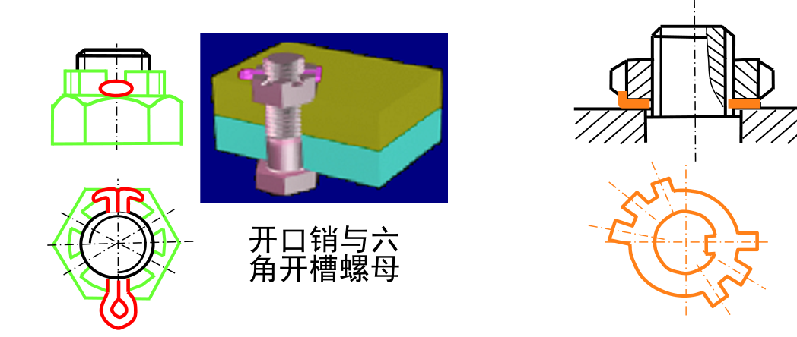

- 其他方法防松 

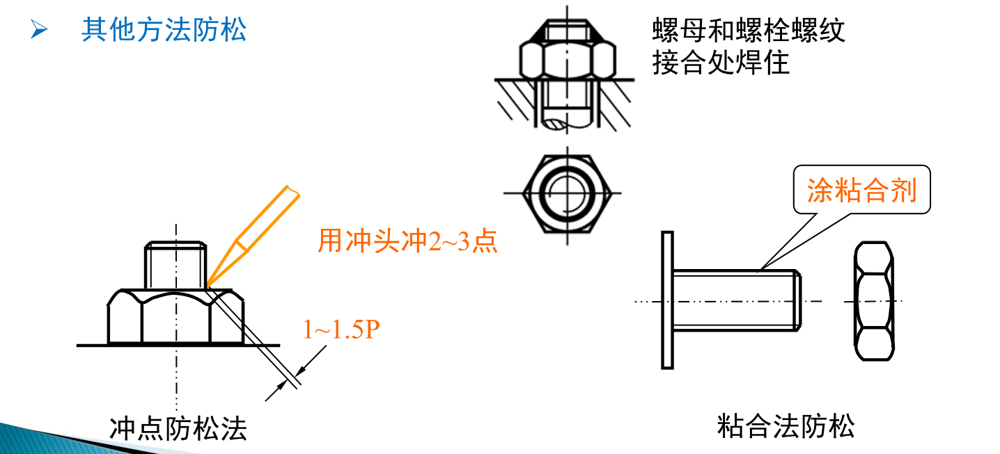

### 强度计算

螺栓联接的主要失效形式：
- 螺栓拉断
- 滑扣，因经常拆装
- 螺纹压溃或剪断

如果选用标准件，则螺栓联接的强度计算主要是校验螺纹的危险截面尺寸

#### 松螺栓联接
$$
\frac{F_{a}}{\pi d_{1}^{2} / 4} \leq[\sigma]
$$

$d_{1}$ 螺纹小径

#### 紧螺栓联接

装配时须要拧紧，在工作状态下可能还需要补充拧紧

##### 只承受预紧力作用的螺栓

###### 螺栓受轴向拉力$F_{a}$和拧紧力矩$T$的双重作用

拉应力
$$
\frac{F_{a}}{\pi d_{1}^{2} / 4} \leq[\sigma]
$$

切应力
$$
\tau=\frac{2 d_{2}}{d_{1}} \tan \left(\lambda+\rho^{\prime}\right) \frac{F_{a}}{\pi d_{1}^{2} / 4}
$$

对于M10~M68的普通螺纹，有
$$\tau \approx 0.5 \sigma$$

当量应力
$$
\sigma_{c}=\sqrt{\sigma^{2}+3 \tau^{2}} \approx 1.3 \sigma
$$

强度条件
$$
\frac{1.3 F_{a}}{\pi d_{1}^{2} / 4} \leq[\sigma]
$$

###### 受横向工作载荷的螺栓强度

螺栓与孔之间有间隙，工作时预紧力$F_{a}$导致接合面所产生的摩擦力应大于横向载荷$F$。

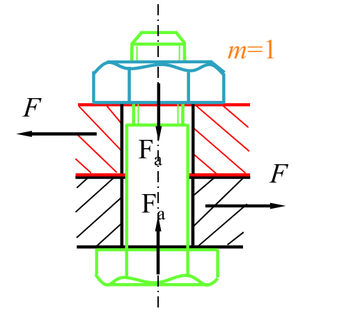

预紧力
$$F_{a} \geq \frac{C F}{m f}$$

$C$：可靠性系数，常取$C=1.1\sim 1.3$
$m$：结合面数
$f$：摩擦系数，对钢与铸铁，$f = 0.1\sim 0.15$

改进措施：
- 采用键、套筒、销承担横向工作载荷。螺栓仅起连接作用。
- 采用无间隙的铰制孔螺栓。

###### 受轴向工作载荷的螺栓强度

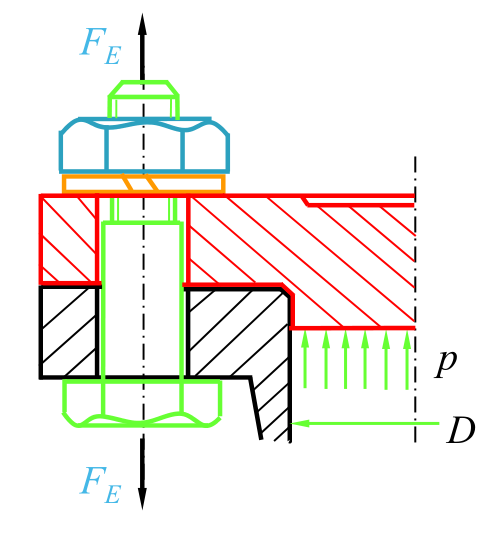

要求具有足够大的预紧力$F_{0}$，以保证工作载荷作用时接合面间仍有一定的紧密性。

被联接件放松了$F_{0} \to F_{R}$

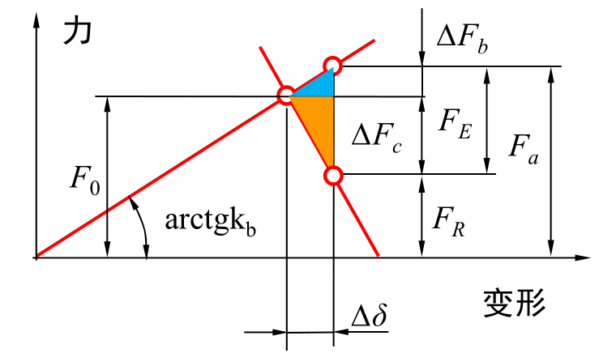

$$
\begin{array}{l}
F_{a}=F_{0}+\Delta F_{b}=F_{0}+k_{b} \Delta \delta \\
F_{R}=F_{0}-\Delta F_{c}=F_{0}-k_{c} \Delta \delta \\
F_{E}=\Delta F_{b}+\Delta F_{c}=\left(k_{b}+k_{c}\right) \Delta \delta
\end{array}
$$

$$
F_{a}=F_{0}+F_{E} \frac{k_{b}}{k_{b}+k_{c}}
$$

$$
F_{R}=F_{0}-F_{E}\left(1-\frac{k_{b}}{k_{b}+k_{c}}\right)
$$

#### 铰制孔螺栓联接（受剪螺栓联接）

当联接承受横向载荷$F$时，位于接合面处的螺栓横截面受剪切，螺栓与孔壁的接触表面受挤压。

联接的拧紧力矩一般不大，联接损坏的可能形式是螺栓被剪断，栓杆或孔壁被压溃等，联接的预紧力和摩擦力可忽略不计。

剪切强度条件
$$\tau=\frac{F}{z m \pi d_{0}^{2}/ 4} \leq[\tau]$$

挤压强度条件
$$\sigma_{p}=\frac{F}{z d_{0} \delta} \leq\left[\sigma_{p}\right]$$

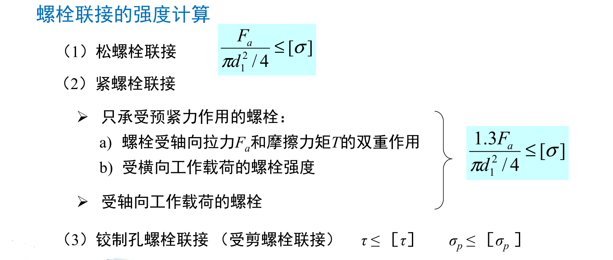

