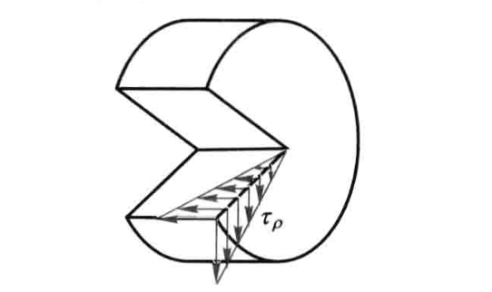

# 扭转

## 扭转的概念

扭转角$\varphi$，弧度制

剪应变$\gamma$

$$\gamma=\frac{r \varphi}{l}$$

其中$l$为圆筒的长度

## 扭矩

### 外力矩的求法

$$
\left\{M_{\mathrm{e}}\right\}_{\mathrm{N} \cdot \mathrm{m}}=9549 \frac{\{P\}_{\mathrm{kW}}}{\{n\}_{\mathrm{r} / \mathrm{min}}}
$$

### 扭矩和扭矩图

扭矩$T$的符号规定如下：若按右手螺旋法则把$T$表示为矢量，当矢量方向与截面的外法线的方向一致时，$T$为正；反之，为负。也即当力偶矩矢的指向离开截面时为正，反之为负。

截面法求扭矩，且可画出扭矩图

## 纯剪切

### 薄壁圆筒

半径$r$，筒壁厚度$\delta$，外加扭转力矩$M_{e}$，横截面上只有切应力$\tau$，则有

$$
\tau=\frac{M_{\mathrm{e}}}{2 \pi r^{2} \delta}
$$

### 切应力互等定理

材料内部，在相互垂直的两个平面上，切应力必然成对存在，且数值相等；两者都垂直于两个平面的交线，方向则共同指向或共同背离这一交线。这就是切应力互等定理。

### 剪切胡克定律

材料内部单元体的上、下、左、右四个侧面上，只有切应力并无正应力，这种情况称为纯剪切。

剪切胡克定律
$$\tau=G \gamma$$

式中$G$为比例常数，称为材料的切变模量。因$\gamma$量纲为$1$，$G$的量纲与$\tau$相同。钢材的$G$值约为80GPa。

至此，我们已经引用了三个弹性常数，即弹性模量$E$、泊松比$\mu$和切变模量$G$。对各向同性材料，可以证明三个弹性常数$E,G,\mu$之间存在下列关系
$$
G=\frac{E}{2(1+\mu)}
$$

### 剪切应变能

$$
v_{\varepsilon}=\frac{1}{2} \tau \gamma=\frac{\tau^{2}}{2 G}
$$

## 圆轴扭转时的应力

### 变形几何关系

圆轴扭转变形前原为平面的横截面，变形后仍保持为平面，形状和大小不变，半径仍保持为直线；且相邻两截面间的距离不变。这就是**圆轴扭转的平面假设**。

距圆心为$\rho$处的切应变为
$$
\gamma_{\rho}=\rho \frac{\mathrm{d} \varphi}{\mathrm{d} x}
$$

切应变发生于垂直于半径的平面内。

### 物理关系

由剪切胡克定律，横截面上距圆心为$\rho$处的切应力为
$$\tau_{\rho}=G \gamma_{\rho}$$

切应力沿半径方向的分布如图

### 静力关系

内力系对圆心的力矩
$$
T=\int_{A} \rho \tau_{\rho} \mathrm{d} A
$$

记
$$
I_{\mathrm{p}}=\int_{A} \rho^{2} \mathrm{~d} A
$$

称为横截面对圆心$O$点的极惯性矩(截面二次极矩)。

综合上式，可推出
$$
\tau_{\rho}=\frac{T \rho}{I_{\mathrm{p}}}
$$

引用记号
$$W_{\mathrm{t}}=\frac{I_{\mathrm{p}}}{R}$$

称为抗扭截面系数，则有
$$\tau_{\max }=\frac{T}{W_{t}}$$

以上各式是以平面假设为基础导出的。试验结果表明，只有对横截面不变的直圆轴，平面假设才是正确的。所以这些公式只适用于等直圆杆。对圆截面沿轴线变化缓慢的小锥度锥形杆，也可近似地用这些公式计算。

建立圆轴扭转的强度条件
$$\tau_{\max }=\frac{T_{\max }}{W_{t}} \leqslant[\tau]$$