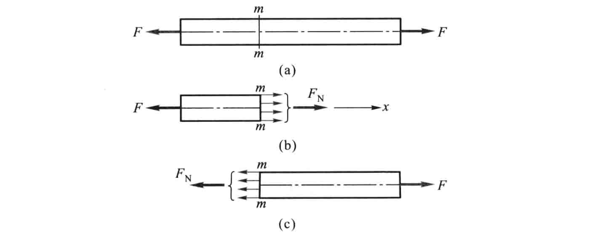
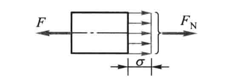
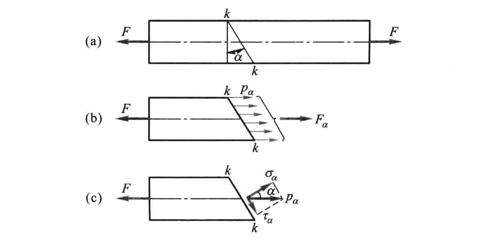
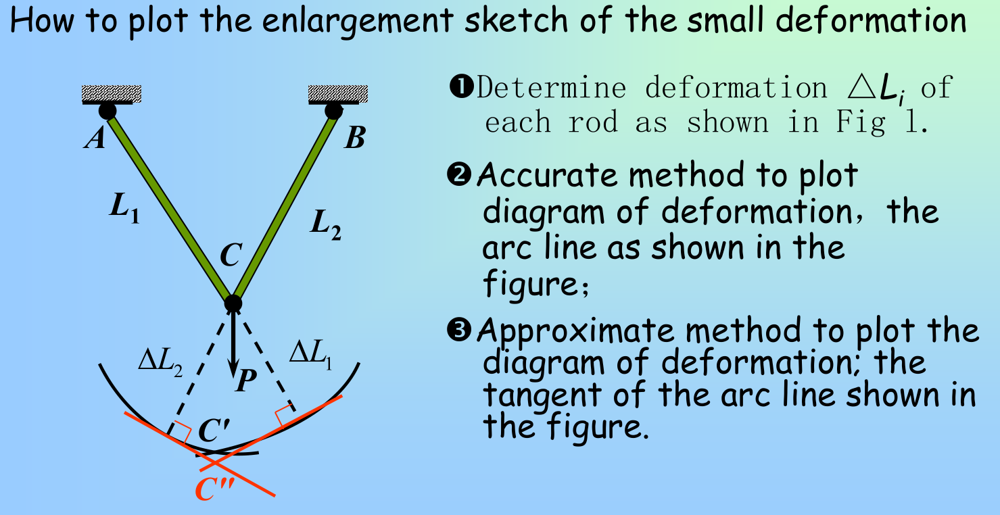
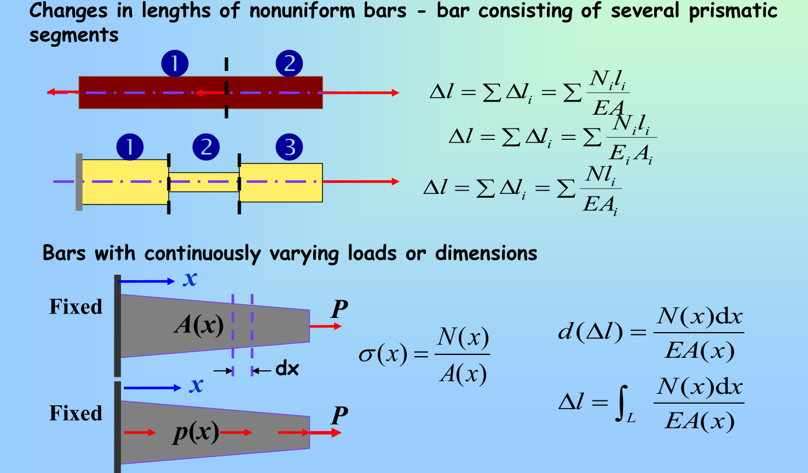

# 拉伸、压缩与剪切
Tension, Compression & Direct Shear

## 轴向拉伸与压缩
Axial Tension and Compression

作用于杆件两端的外力合力的作用线与杆件轴线重合，杆件变形是沿轴线方向的伸长或缩短。

### 轴力

为了显示拉(压)杆横截面上的内力，沿横截面m-m假想地把杆件分成两部分。杆件左右两段在横截面m-m上相互作用的内力是一个分布力系，其合力为轴力$F_{N}$。

$$F_{N}=F$$

若选取一个坐标系，其横坐标表示横截面的位置，纵坐标表示相应截面上的轴力，便可用图线表示出沿活塞杆轴线轴力变化的情况。这种图线即为**轴力图(Axial force diagram)**。

例如

### 横截面上的应力

$$F_{\mathrm{N}}=\int_{A} \sigma \mathrm{d} A$$

平面假设(Plane cross-section assumption)：如果横截面最初为平面，则变形后仍保持平面，并垂直于轴线。

应变相同，应力也相同。因此横截面上应力相同，即
$$\sigma=\frac{F_{N}}{A}$$

若以集中力作用于杆件端截面上，则集中力作用点附近区域内的应力分布比较复杂，上式只能计算这个区域内横截面上的平均应力，不能描述作用点附近的真实情况。

Saint-Venant原理：如用与外力系静力等效的合力来代替原力系，则除在原力系作用区域内有明显差别外，在离外力作用区域略远处(例如距离约等于横截面尺寸处)，上述代替的影响就非常微小，可以不计。

### 斜截面上的应力

$$
p_{\alpha}=\frac{F}{A} \cos \alpha=\sigma \cos \alpha
$$

$$
\sigma_{\alpha}=\sigma \cos ^{2} \alpha
$$

$$
\tau_{\alpha}=\frac{\sigma}{2} \sin 2 \alpha
$$

当$\alpha=45^{\circ}$时，切应力最大。因此材料受压断裂面与轴线夹角往往为$45^{\circ}$。

## 材料的力学性能

Strength, hardness, toughness, elasticity, plasticity, brittleness, ductility and malleability

强度、硬度、韧性、弹性、塑性、脆性、延展性

### 拉伸的力学性能

把拉力$F$除以试样横截面的原始面积$A$，得出正应力$\sigma=F/A$；同时，把伸长量$\Delta l$除以标距的原始长度$l$，得到应变$\varepsilon=\Delta l/l$。附带指出，$\varepsilon$是标距$l$内的平均应变。因在标距$l$内各点应变相等，应变是均匀的，这时，任意点的应变都与平均应变相同。

#### 弹性阶段 Elastic Range ($O-b$)

处于弹性变形

$O-a$，胡克定律(Hooke’s Law)
$$\sigma=E \varepsilon$$

比例极限(Proportional limit) $\sigma_{P}$

$a-b$，不是直线，但仍然弹性变形

弹性极限(Elastic limit) $\sigma_{e}$

#### 屈服阶段 Yielding Range ($b-d$)

这种应力基本保持不变，而应变显著增加

将$\sigma - \delta$曲线上应力首次下降前的最大应力判定为上屈服极限(Upper yielding limit)，将不计初始瞬时效应(即舍去第一个谷值应力)时屈服阶段内最小的应力定义为下屈服极限(Lower yielding limit)

Lower yielding limit $\sigma_{s}$, which reflects the strength of materials

Yielding is related to the maximum shearing stress

#### 强化阶段 Hardening Stage ($d-e$)

$\sigma$ have to be increased when it is elongated further (or $\delta$ increasing)

Ultimate strenth $\sigma_{b}$, which also reflects the strength of materials

#### 缩颈阶段 Necking Range ($e-f$)

最终被拉断

#### 伸长率和断面收缩率 Elongation & Reduction of Area

试样拉断后，由于保留了塑性变形，试样标距由原来的$l$变为$l_{1}$。用百分比表示的比值称为伸长率
$$
\delta=\frac{l_{1}-l}{l} \times 100 \%
$$

原始横截面面积为$A$的试样，拉断后缩颈处的最小截面面积变为$A_{1}$，用百分比表示的比值称为断面收缩率
$$
\psi=\frac{A-A_{1}}{A} \times 100 \%
$$

Both $\delta$ and $\psi$ reflect plasticity of materials

$\delta < 5\%$, Brittle materials: cast iron, glass, ceramics
$\delta > 5\%$, Ductile materials: carbon steel, copper, aluminum alloy

#### 卸载定律及冷作硬化 Unloading and Cold-hardenging

如把试样拉到超过屈服极限的$d$点，然后逐渐卸除拉力，应力和应变关系将沿着斜直线$d d^{\prime}$回到$d^{\prime}$点。斜直线$d d^{\prime}$近似地平行于$O a$。这说明，在卸载过程中，应力和应变按直线规律变化。这就是卸载定律。

拉力完全卸除后，$\sigma - \delta$曲线图中，$d^{\prime} g$表示消失了的弹性变形，而$O d^{\prime}$表示不再消失的塑性变形。

#### Mechanical Properties of other Ductile Materials in Tension

对没有明显屈服极限的塑性材料，可以将产生0.2%塑性应变时的应力作为屈服指标，称为规定塑性延伸强度，并用$\sigma_{p 0.2}$来表示

灰口铸铁没有屈服和缩颈现象，其为典型的脆性材料。常取$\sigma - \delta$曲线的割线代替曲线的开始部分，并以割线的斜率作为弹性模量，称为割线弹性模量

### Mechanical Properties of Materials under Compression

脆性材料抗拉强度低，塑性性能差，但抗压能力强

综上所述，衡量材料力学性能的指标主要有：比例极限(或弹性极限)$\sigma_{P}$、屈服极限$\sigma_{s}$、强度极限$\sigma_{b}$、弹性模量$E$、伸长率$\delta$和断面收缩率$\psi$等。对很多金属来说，这些量往往受温度、热处理等条件的影响。

## Criterion of Strength Design

### Safety factor and Allowable stress

Failure
1. Plastic deformation(ductile)
2. Fracture (brittle)

Limit stress $\sigma_{u}$
$$
\sigma_{\mathrm{u}}=\left\{\begin{array}{l}
\sigma_{\mathrm{s}} \text { Ductile } \\
\sigma_{\mathrm{b}} \text { Brittle }
\end{array}\right.
$$

Allowable stress, $n$ is Safety Factor
$$
[\sigma]=\frac{\sigma_{u}}{n}=\left\{\begin{array}{lll} {\sigma_{s}}/{n_{s}} & \text { ductile: } & n_{s}=1.2-2.5 \\
{\sigma_{b}}/{n_{b}} & \text { brittle: } & n_{b}=2-3.5
\end{array}\right.
$$

### Criterion of Strength Design

$$
\sigma=\frac{F_{N}}{A} \leq[\sigma]
$$

## 轴向拉伸或压缩时的变形 Deformation of Bar under Tension and Compression

试验结果表明:当应力不超过比例极限时，横向应变(Lateral strain)$\varepsilon^{\prime}$与轴向应变(Axial strain)$\varepsilon$之比是一个常数。可写成
$$\mu=-\frac{\varepsilon^{\prime}}{\varepsilon}$$

$\mu$称为横向变形因数或泊松比(Poisson’s ratio)

由热力学原理可以给出各向同性材料$\mu$的取值范围为
$$-1 \leqslant \mu \leqslant 1 / 2$$

For steel, $E$ is about 200GPa, and $\mu$ about 0.25—0.33

## 轴向拉伸或压缩的应变能 Strain Energy of Bar under Tension and Compression

应变能(Strain energy): The energy which is stored within an deformable body due to its deformation

$$
v_{\varepsilon}=\frac{1}{2} \sigma \varepsilon=\frac{E \varepsilon^{2}}{2}=\frac{\sigma^{2}}{2 E}
$$

$$V_{\varepsilon}=\int_{V} v_{\varepsilon} \mathrm{d} V$$

## 静不定结构 Statistically Indeterminate Structures

静不定结构：结构的强度和刚度均得到提高，约束反力不能由平衡方程求得

静不定度（次）数：约束反力多于独立平衡方程的数

独立平衡方程数：
1. 平面任意力系，3个平衡方程
2. 平面共点力系，2个平衡方程
3. 平面平行力系，2个平衡方程
4. 平面共线力系，1个平衡方程

Method and steps for solving statically indeterminate problems:

1. Equilibrium equations；
2. Geometric equation—compatibility equation of deformation；
3. Physical equation — Constitutive law；
4. Complementary equation：from geometric equation and physical equation
5. Solving equilibrium equations and the complementary equation.

## Stress Concentration