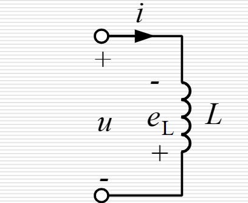
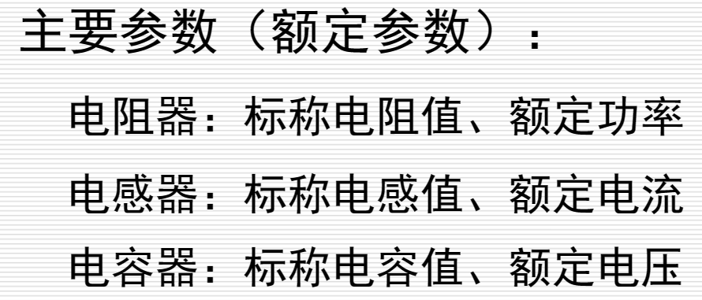
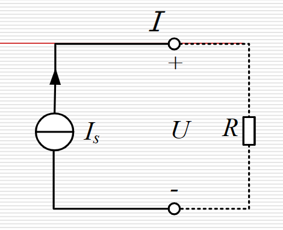
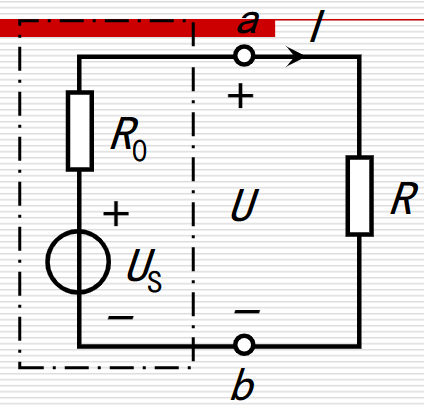

## 电路

### 电流与电压

电流方向：正电荷移动方向。

<!-- 电压定义
$$u=\frac{\mathrm{d} W}{\mathrm{d} q}$$

式中$\mathrm{d} q$为由电路的一点移到另一点的电荷量，$\mathrm{d} W$为转移过程中，电荷$\mathrm{d} q$所失去的能量。 -->

电压是由于两点间电位的高低差别而形成的，它的方向是从高电位指向低电位，是电位降低的方向。

$$U_{\mathrm{ab}}=V_{\mathrm{a}}-V_{\mathrm{b}}$$

### 关联参考方向

电压参考方向和电流参考方向可以分别加以假定。但在电路分析时**对电源以外**的元件(或电路)常假定电压参考方向与电流参考方向一致，即电流参考方向从电压参考方向的“+”端流向“-”端，称为关联参考方向。

即
$$u_{N}=u_{ab}$$

### 功率

功率$p=u i$。在电压和电流参考方向关联时，功率为正值表示该元件(或该段电路)吸收功率(即消耗电能或吸收电能)；若为负值则表示输出功率(即送出电能)。

## 电阻、电感与电容

### 电阻

### 电感

$$u=-e_{L}=L \frac{\mathrm{d} i}{\mathrm{d} t}$$

$e_{L}$为自感电动势。

线性电感，$L$为常数，特性方程为
$$N \Phi=L i$$

当时间由$0$到$t_{1}$，流过电感的电流$i$由$0$变到$I$时，电感所储存的磁场能为
$$
W_{L}=\int_{0}^{t_{1}} u i \mathrm{~d} t=\int_{0}^{I} L i \mathrm{~d} i=\frac{1}{2} L I^{2}
$$

### 电容

$$i=C \frac{\mathrm{d} u}{\mathrm{d} t}$$

在线性电容的情况下，电容元件的特性方程为
$$q=C u$$

当时间由$0$到$t_{1}$，电容的端电压$u$由$0$变到$U$时，电容所储存的电场能为
$$
W_{C}=\int_{0}^{t_{1}} u i \mathrm{~d} t=\int_{0}^{U} C u \mathrm{~d} u=\frac{1}{2} C U^{2}
$$

## 独立电源元件

### 理想电源

电压源、电流源

### 实际电源

<!-- 
 -->

#### 电压源

$$U=U_{\mathrm{s}}-R_{0} I$$

#### 电流源

$$I=I_{S}-\frac{U}{R_{0}}$$

