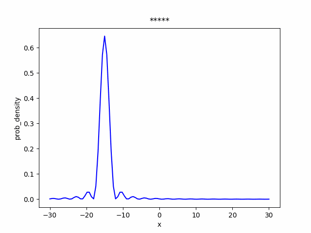

#! https://zhuanlan.zhihu.com/p/608306983
# 量子力学速通(1)初探微观世界

微观世界的物理图像与宏观世界截然不同。这里先说微观粒子（如电子），经典力学的模型使用点和牛顿三大定律来描述，但这种描述并不适用于微观情况。下面介绍使用波函数和薛定谔方程来描述微观粒子的行为。这种描述方式在量子力学中被广泛使用，可以更好地解释许多微观现象。

---

## 波函数

在量子力学中，用**波函数**来描述微观粒子，记作$\Psi(\boldsymbol{r}, t)$。这是一个复变函数，其输入为坐标$\boldsymbol{r}$和时间$t$，**输出为一个复数**。可以认为，波函数存储了粒子的许多信息。

首先是粒子的位置。众所周知，量子力学总和概率联系在一起。粒子的波函数的模的平方，表示粒子在坐标$\boldsymbol{r}$的概率密度，即
$$
P(\boldsymbol{r},t) = |\Psi(\boldsymbol{r},t)|^2 \tag{1}
$$
这个函数可以用来计算在任意时刻 $t$ 粒子被观测到时，它处于空间中某个给定的体积元内的概率。需要注意的是，这种概率密度函数描述的是一个粒子存在的概率密度，而不是粒子的实际位置。在进行观测之前，我们无法得知粒子的实际位置，只能通过多次观测，根据观测结果的统计规律推断其在空间中的分布情况。

由于概率的归一性，于是有
$$
\int_{V}|\Psi(\boldsymbol{r}, t)|^{2} \mathrm{~d} \boldsymbol{r}=1 \tag{2}
$$
其中$V$代表整个空间。这就是波函数的**归一化条件**。

紧接着，我们可以计算粒子坐标的期望
<!-- $$
\langle \boldsymbol{r} \rangle=\int_{V} \boldsymbol{r} |\Psi(\boldsymbol{r}, t)|^{2} \mathrm{d} \boldsymbol{r} \tag{3}
$$ -->
$$
\langle x\rangle=\int x|\Psi(x, t)|^{2} \mathrm{~d} x
$$
$y,z$同理。

紧接着是动量，为了简便起见，我们只考虑一维的情况
$$
\langle p\rangle=m \frac{\mathrm{d}\langle x\rangle}{\mathrm{d} t}=\int \Psi^{*}\left(-\mathrm{i} \hbar \frac{\partial}{\partial x}\right) \Psi \mathrm{d} x \tag{3}
$$
注意，这里粒子质量$m$消失了，并出现了虚数单位$\mathrm{i}$和约化普朗克常数$\hbar$。这是因为这里动量的推导用到了薛定谔方程，不必在意。

可以定义动量算符$\hat{p}$
$$
\hat{p}=-\mathrm{i} \hbar \frac{\partial}{\partial x} \tag{4}
$$

观察式(3)的结构，有一个有趣的结论，就是如果一个物理量（如能量）可以用坐标和动量表示，即$Q(x,p)$，则可以代入动量算符，使其成为一个算符$\hat{Q}(x,\hat{p})$，且有
$$
\langle\hat{Q}\rangle=\int \Psi^{*} \hat{Q}(x, \hat{p}) \Psi \mathrm{d} x \tag{5}
$$

举个例子，动能算符$\hat{T}$为
$$
\hat{T}=-\frac{\hbar^{2}}{2 m} \frac{\partial^{2}}{\partial x^{2}} \tag{6}
$$

则动能的期望为
$$
\langle\hat{T}\rangle=-\frac{\hbar^{2}}{2 m} \int \Psi^{*} \frac{\partial^{2} \Psi}{\partial x^{2}} \mathrm{~d} x \tag{7}
$$

综上所述，波函数可以用来描述粒子，波函数包含了粒子的许多信息。

## 薛定谔方程

有了描述微观粒子运动的工具后，就可以用**薛定谔方程**描述粒子的运动规律
<!-- $$
i \hbar \frac{\partial \Psi}{\partial t}=-\frac{\hbar^{2}}{2 m} \frac{\partial^{2} \Psi}{\partial x^{2}}+V \Psi
$$ -->
$$
\mathrm{i} \hbar \frac{\partial \Psi}{\partial t}=-\frac{\hbar^{2}}{2 m} \nabla^{2} \Psi+V \Psi \tag{8}
$$
其中$\mathrm{i}$为虚数单位，$\hbar$为约化普朗克常数。$V(\boldsymbol{r},t)$是势能函数，其含义与经典力学一致。

薛定谔方程的作用和地位从逻辑上讲就像牛顿第二定律：给定适当的初始条件（一般为$\Psi(\boldsymbol{r},0)$），然后通过薛定谔方程解出波函数$\Psi(\boldsymbol{r},t)$。

下图展示了，当势能恒为0时，一个粒子的波函数随时间的变化。图中曲线代表了粒子的概率分布，即波函数的模的平方。

